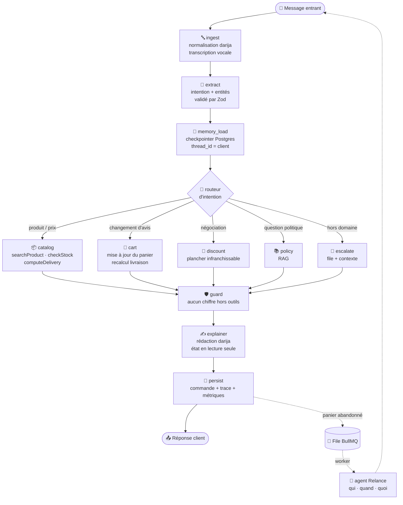

<div align="center">
# 🛍️ Kenza
 
### L'agent commercial WhatsApp qui vend vraiment
 
*Un vendeur autonome qui conseille, encaisse et relance — en darija.*
 
<br>


 
<br>
**ESISA × Numeos Technology** · 17 — 19 septembre 2026 · `#NumeosHack26`
 
🎬 **[Démo vidéo (2 min)](<lien-a-inserer>)** · 👥 **Équipe :** `<noms>`
 
</div>
---
 
## 📑 Sommaire
 
| | Section | |  | Section |
|---|---|---|---|---|
| 1 | [Le problème](#1--le-problème) | | 7 | [Couverture des exigences](#7--couverture-des-exigences) |
| 2 | [Ce que fait Kenza](#2--ce-que-fait-kenza) | | 8 | [La darija, traitée sérieusement](#8--la-darija-traitée-sérieusement) |
| 3 | [Principe de conception](#3--principe-de-conception) | | 9 | [Tests](#9--tests) |
| 4 | [Architecture agentique](#4--architecture-agentique) | | 10 | [Observabilité et traçabilité](#10--observabilité-et-traçabilité) |
| 5 | [Stack technique](#5--stack-technique) | | 11 | [Hors périmètre](#11--hors-périmètre) |
| 6 | [Démarrage rapide](#6--démarrage-rapide) | | 12 | [Sécurité](#12--sécurité) |
 
---
 
## 1 · 🎯 Le problème
 
Au Maroc, une part majeure du commerce de détail se fait **par messagerie**. Un e-commerçant, une
boutique de prêt-à-porter ou une clinique reçoit chaque jour **150 à 300 messages** :
 
> — *chhal taman ?*
> — *vous livrez à Fès ?*
> — *je veux la même en bleu*
 
Le commerçant répond quand il peut, souvent le soir. Entre-temps, **le client a acheté ailleurs**.
Et personne ne relance jamais un panier abandonné — non par choix, mais faute de temps.
 
### 👤 Utilisateur cible
 
Le commerçant lui-même, ou son unique employé chargé des commandes. **Il n'est pas technicien.**
Il veut voir ses ventes augmenter sans apprendre un nouvel outil. Toute décision de conception
part de cette contrainte : zéro configuration, zéro vocabulaire technique, zéro apprentissage.
 
---
 
## 2 · ✨ Ce que fait Kenza
 
<table>
<tr>
<td width="50%" valign="top">
### 💬 Côté client
 
- Répond **en darija, en arabe ou en français**, dans la langue du message reçu
- Qualifie le besoin et **conseille un produit**
- Vérifie le **stock réel** avant toute promesse
- Calcule les **frais de livraison** selon la ville
- Met à jour le panier quand le client **change d'avis**
- **Crée la commande** en base
- **Relance** si le panier est abandonné
</td>
<td width="50%" valign="top">
### 📊 Côté commerçant
 
- **Conversations en cours**, en temps réel
- **Taux de conversion** de l'agent
- **Ventes réalisées** sans intervention humaine
- **File d'escalade** : ce que l'agent n'a pas su traiter, avec le contexte complet
- Reprise de la main en un clic
</td>
</tr>
</table>
---
 
## 3 · 🛡️ Principe de conception
 
> [!IMPORTANT]
> **Axiome « zéro hallucination »**
>
> Le **code déterministe** calcule, applique la logique métier et valide les règles.
> Le **LLM** orchestre, extrait, raisonne et explique en langage naturel.
>
> Aucun prix, aucun délai, aucun stock, aucune décision commerciale n'est laissé au modèle.
 
### Comment c'est garanti, concrètement
 
| Garde-fou | Mécanisme |
|---|---|
| 🔢 **Aucun chiffre inventé** | Tout montant affiché provient d'un **retour d'outil**. Le nœud `guard` s'exécute avant la rédaction et rejette tout chiffre absent de l'état. |
| 📦 **Aucun stock promis à tort** | Le catalogue n'est **jamais recopié dans un prompt**. L'agent interroge la base par appel d'outil, à chaque fois. |
| 💸 **Aucune remise sauvage** | Le plancher vit dans `engines/discount.ts`, en TypeScript pur. Le modèle ne peut pas le franchir, même si on le lui demande poliment. |
| 📐 **Aucune sortie malformée** | Chaque réponse du LLM est validée par un **schéma Zod**. Une extraction non conforme déclenche une reformulation ou une escalade — jamais une supposition. |
| 🙋 **Aucune improvisation hors domaine** | L'agent d'escalade détecte ce qu'il ne sait pas traiter et **passe la main** avec le contexte. |
 
> [!NOTE]
> Les modules de `src/engines/` sont du TypeScript pur : **pas d'`await`, pas d'appel réseau,
> pas de LLM**. Ils sont couverts par des tests unitaires et constituent le socle sur lequel
> repose toute la fiabilité du système.
 
---
 
## 4 · 🧠 Architecture agentique
 
Cinq responsabilités **séparées**, une orchestration **explicite**. Un unique appel au modèle qui
produirait tout le résultat ne satisferait pas cette exigence — et ne tiendrait pas devant les cas
tordus.
 
### Les agents
 
| | Agent | Responsabilité |
|---|---|---|
| 💬 | **Conversation** | Boucle stateful avec mémoire par client. Ne redemande **jamais** une information déjà donnée. |
| 📦 | **Catalogue** | Outils réels : recherche produit, stock, calcul de livraison, création de commande. |
| 🔔 | **Relance** | Décide **seul** qui relancer, quand, et avec quel message. Autonome et planifié. |
| 🛡️ | **Garde-fou** | Interdit d'inventer un prix ou un délai hors des données du catalogue. |
| 🙋 | **Escalade** | Détecte ce qu'il ne sait pas traiter et transfère au commerçant avec le contexte. |
 
### Le graphe
 

 
### 🧠 Mémoire : deux niveaux, deux supports
 
| Niveau | Support | Rôle | Durée de vie |
|---|---|---|---|
| **Court terme** | Redis | État de la conversation en cours, cache des appels LLM | La session |
| **Long terme** | Checkpointer Postgres LangGraph | Mémoire par client d'une session à l'autre | Permanente |
 
C'est le second niveau qui permet à l'agent de se souvenir **d'un échange de la veille** — et donc
de ne pas faire répéter le client, ce qui est la première cause d'abandon.
 
### 🔔 Relances : pourquoi une file, pas un timer
 
Les relances sont des **tâches planifiées BullMQ** sur Redis, exécutées par un worker dédié.
 
> [!WARNING]
> Un `setTimeout` dans l'API **disparaît au redémarrage**. Une relance promise et jamais envoyée
> est pire que pas de relance du tout. La file survit aux redémarrages, aux crashs et aux
> déploiements.
 
L'agent de relance décide **lui-même** de la cible, du délai et du contenu, à partir de l'état du
panier et de l'historique du client.
 
---
 
## 5 · ⚙️ Stack technique
 
| Couche | Technologie | Pourquoi |
|---|---|---|
| 🖥️ **Interface** | React 18 + TypeScript (Vite) | Une SPA sobre. Toute l'évaluation passe par elle. |
| 🔌 **API et agents** | Node.js 20 + TypeScript (Fastify) | Un seul langage du front aux agents. Le typage sert de **contrat entre les agents**. |
| 🧩 **Orchestration** | LangGraph (`@langchain/langgraph`) | Le graphe rend la boucle agentique explicite : états, reprises, checkpoints. |
| 🗄️ **Base de données** | PostgreSQL 16 | Source de vérité métier **et** persistance des checkpoints LangGraph. |
| ⚡ **Cache et files** | Redis 7 | Cache LLM, état conversationnel court, file de tâches (BullMQ). |
| 🤖 **Modèle** | Endpoint LLM Numeos (compatible OpenAI) | Une base URL, une clé. Aucun code spécifique à un fournisseur. |
| 🐳 **Exécution** | Docker Compose | Cinq services, une commande. |
 
### 📁 Structure du dépôt
 
```
hackathon_numeos/
├── 🐳 docker-compose.yml          5 services : web · api · worker · postgres · redis
├── 🔐 .env.example                variables requises, valeurs vides
│
├── apps/
│   ├── 🖥️ web/                    SPA React
│   │   ├── src/chat/              simulateur de conversation (WebSocket)
│   │   └── src/dashboard/         tableau de bord commerçant
│   │
│   ├── 🔌 api/                    Fastify + agents
│   │   ├── src/agents/            nœuds du graphe LangGraph
│   │   ├── src/engines/           ⚠️ logique métier déterministe — zéro LLM
│   │   │   ├── pricing.ts         prix, remises, total
│   │   │   ├── discount.ts        plancher de remise infranchissable
│   │   │   ├── delivery.ts        frais de livraison par ville
│   │   │   ├── stock.ts           disponibilité et variantes
│   │   │   └── order.ts           création et validation de commande
│   │   ├── src/schemas/           schémas Zod — contrats entre agents
│   │   ├── src/tools/             outils exposés au modèle
│   │   ├── src/rag/               indexation politique + conversations darija
│   │   └── src/lang/              normalisation arabizi ↔ arabe
│   │
│   └── 🔔 worker/                 worker BullMQ — relances planifiées
│
├── db/
│   ├── migrations/                schéma métier + tables de checkpoints
│   └── seed/                      catalogue, clients, commandes, livraison, politique
│
└── 🧪 tests/
    ├── unit/                      moteurs déterministes
    └── e2e/                       scénarios de bout en bout
```
 
---
 
## 6 · 🚀 Démarrage rapide
 
### Prérequis
 
- 🐳 Docker et Docker Compose
- 🔑 Une clé API et une base URL pour l'endpoint LLM Numeos
### Installation
 
```bash
# 1 · Cloner
git clone https://github.com/Zakaria-laribi/hackathon_numeos.git
cd hackathon_numeos
 
# 2 · Configurer
cp .env.example .env
#    renseigner LLM_BASE_URL et LLM_API_KEY
 
# 3 · Démarrer
docker compose up --build
```
 
Au premier démarrage, les **migrations et le seed s'exécutent automatiquement** : catalogue de 80
références avec stock, 120 clients, 320 commandes historiques, grille de livraison, politique
commerciale et 40 conversations de référence.
 
> [!TIP]
> `docker compose up` doit suffire **sur une machine vierge**. Si ce n'est pas le cas chez vous,
> c'est un bug — ouvrez une issue plutôt que de contourner.
 
### 🌐 Accès
 
| Service | URL |
|---|---|
| 💬 Simulateur de chat | http://localhost:5173 |
| 📊 Tableau de bord commerçant | http://localhost:5173/dashboard |
| 🔌 API | http://localhost:3000 |
| 🗄️ PostgreSQL | `localhost:5432` |
| ⚡ Redis | `localhost:6379` |
 
### 🔑 Variables d'environnement
 
| Variable | Description | Exemple |
|---|---|---|
| `LLM_BASE_URL` | Base URL de l'endpoint Numeos | `https://…/v1` |
| `LLM_API_KEY` | Clé API personnelle — **jamais commitée** | `sk-…` |
| `LLM_MODEL` | Identifiant du modèle | `…` |
| `DATABASE_URL` | Connexion PostgreSQL | `postgres://…` |
| `REDIS_URL` | Connexion Redis | `redis://redis:6379` |
| `RELANCE_DELAY_MINUTES` | Délai avant relance d'un panier abandonné | `30` |
| `DISCOUNT_FLOOR_PCT` | Plancher de remise, en pourcentage | `10` |
 
---
 
## 7 · ✅ Couverture des exigences
 
| | Exigence | Implémentation |
|---|---|---|
| **EX-01** | Conversation de bout en bout jusqu'à la commande | Simulateur web ↔ WebSocket ↔ graphe LangGraph |
| **EX-02** | Catalogue et stock via **appels d'outils** | `src/tools/` — aucune donnée catalogue dans un prompt |
| **EX-03** | Commande réellement créée en base, visible au dashboard | nœud `persist` → table `orders` → vue dashboard |
| **EX-04** | Mémoire par client entre deux contacts | Checkpointer Postgres, `thread_id` = identifiant client |
| **EX-05** | Relance automatique décidée par l'agent | Agent Relance + file BullMQ + worker dédié |
| **EX-06** | Escalade vers l'humain avec contexte | Nœud `escalate` → file d'escalade du dashboard |
| **EX-07** | Tableau de bord commerçant | Conversations · conversion · commandes · escalades |
| **EX-08** | Français, arabe **et darija** | Normalisation en entrée + RAG few-shot |
 
---
 
## 8 · 🗣️ La darija, traitée sérieusement
 
La darija est une **exigence de premier rang**, pas une traduction ajoutée à la fin.
 
### Le problème réel
 
Pour un moteur de recherche naïf, ces trois messages sont trois requêtes **sans aucun rapport** :
 
```
chhal taman ?        ch7al taman ?        شحال الثمن ؟
```
 
C'est exactement ce qu'un jury testera avec des messages non préparés.
 
### La réponse en trois couches
 
<table>
<tr><td width="30px">1️⃣</td><td>
**Normalisation en entrée** — l'arabizi est ramené à une forme canonique
(`3` → ع, `7` → ح, `9` → ق), graphie latine et graphie arabe convergent vers la même
représentation avant toute recherche ou extraction.
 
</td></tr>
<tr><td>2️⃣</td><td>
**RAG few-shot** — les conversations fournies sont indexées ; les plus proches du message courant
sont injectées comme **exemples de style** au moment de la rédaction. L'agent apprend le registre,
pas seulement le vocabulaire.
 
</td></tr>
<tr><td>3️⃣</td><td>
**Tolérance aux fautes** — l'extraction d'intention s'appuie sur le message normalisé, avec un
schéma Zod strict. Confiance insuffisante → **question de précision ciblée**, jamais une devinette.
 
</td></tr>
</table>
---
 
## 9 · 🧪 Tests
 
```bash
docker compose exec api npm run test:unit   # moteurs déterministes
docker compose exec api npm run test:e2e    # scénarios de bout en bout
```
 
### Scénarios couverts
 
| | Scénario | Comportement attendu |
|---|---|---|
| 📦 | **Rupture de stock** | Annonce la rupture, propose une variante **réellement disponible**, ne promet **aucun** délai de réapprovisionnement. |
| 🔄 | **Changement d'avis** | Met à jour le panier **sans repartir de zéro** et recalcule la livraison. |
| 💸 | **Demande de remise** | Applique au maximum la remise autorisée, **jamais sous le plancher**, sinon escalade. |
| 🙋 | **Question hors domaine** | Escalade au commerçant **avec le contexte**, sans improviser. |
| 🗣️ | **Message ambigu en darija** | Demande une précision ciblée plutôt que de deviner. |
| 🧠 | **Deuxième contact** | Se souvient de la commande précédente, ne refait pas répéter le client. |
 
---
 
## 10 · 🔍 Observabilité et traçabilité
 
Chaque exécution du graphe laisse une **trace complète** :
 
- 🧭 la **liste ordonnée des nœuds** traversés
- 🔧 chaque **appel d'outil**, avec ses arguments et son retour
- 🛡️ chaque **décision du garde-fou**, et ce qui a été bloqué
- 🙋 chaque **escalade**, avec sa raison
La trace est consultable depuis le tableau de bord, conversation par conversation. C'est ce qui
permet de répondre à « pourquoi l'agent a-t-il dit ça ? » autrement que par une supposition — et
c'est le point de départ de tout débogage sérieux d'un système agentique.
 
---
 
## 11 · 🚫 Hors périmètre
 
Conformément au cahier des charges, **ne sont pas implémentés** :
 
- ❌ Le paiement en ligne réel — une commande enregistrée suffit
- ❌ La gestion multi-boutiques et les rôles utilisateurs
- ❌ L'application mobile native
- ❌ La conformité aux politiques commerciales de Meta
Le canal par défaut est le **simulateur de chat web**. Le branchement WhatsApp Cloud API réel est
traité comme un bonus : il dépend d'un compte Meta Business qui peut bloquer le jour de la
démonstration, et le sujet précise explicitement qu'il ne rapporte aucun point obligatoire.
 
---
 
## 12 · 🔐 Sécurité
 
> [!CAUTION]
> **Aucune clé API n'est présente en clair dans ce dépôt.**
> `.env` est listé dans `.gitignore`. Seul `.env.example`, avec des valeurs vides, est versionné.
 
- 🔑 Les secrets passent exclusivement par variables d'environnement
- 🧹 Le `.gitignore` couvre `.env`, `node_modules/`, les artefacts de build et les dumps de base
- 🗄️ Les identifiants Postgres et Redis ne sont utilisés qu'à l'intérieur du réseau Docker
---
 
<div align="center">
**ESISA × Numeos Technology** · `#NumeosHack26`
 
📧 hackathon@numeostechnology.com · 🌐 numeostechnology.com
 
</div>

 
